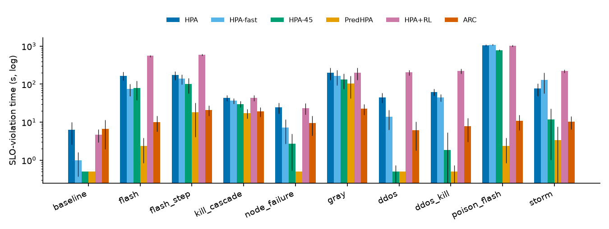
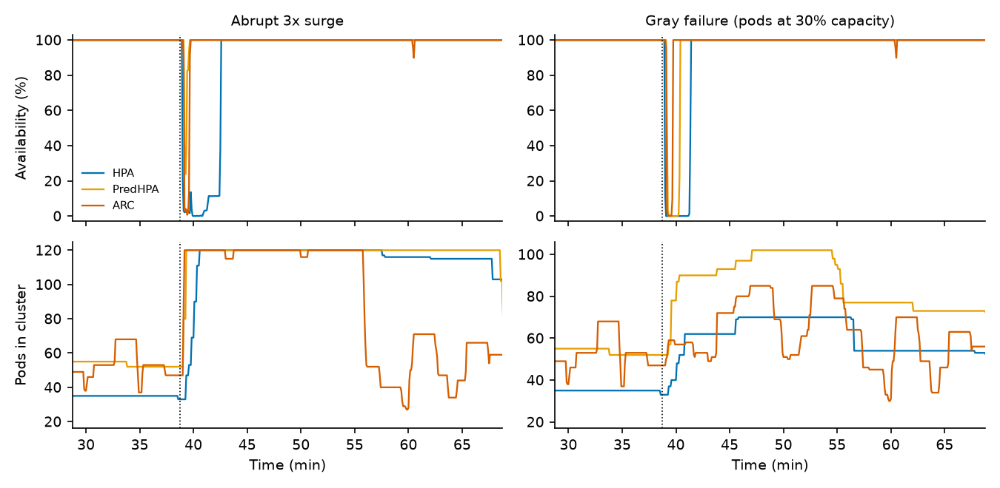
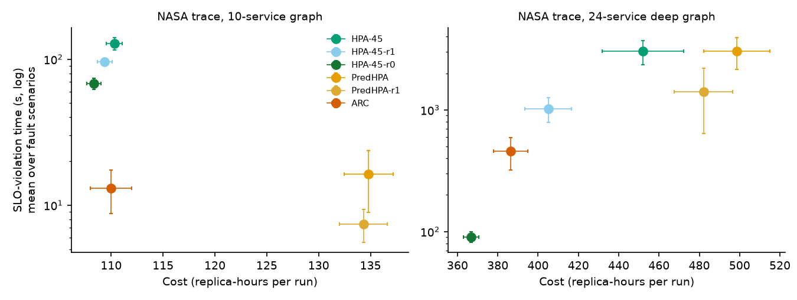
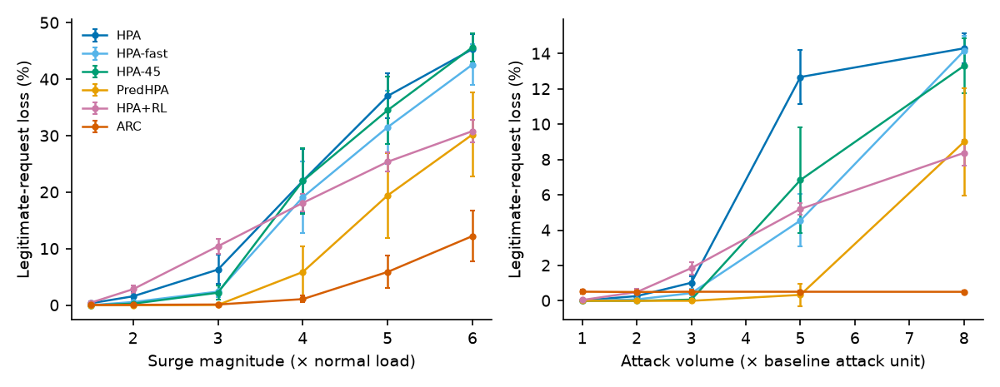
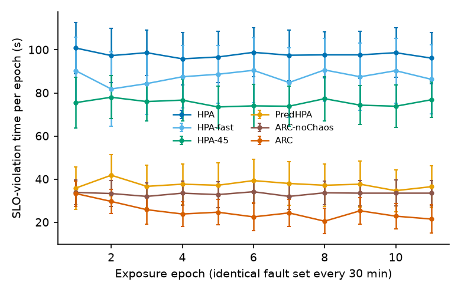
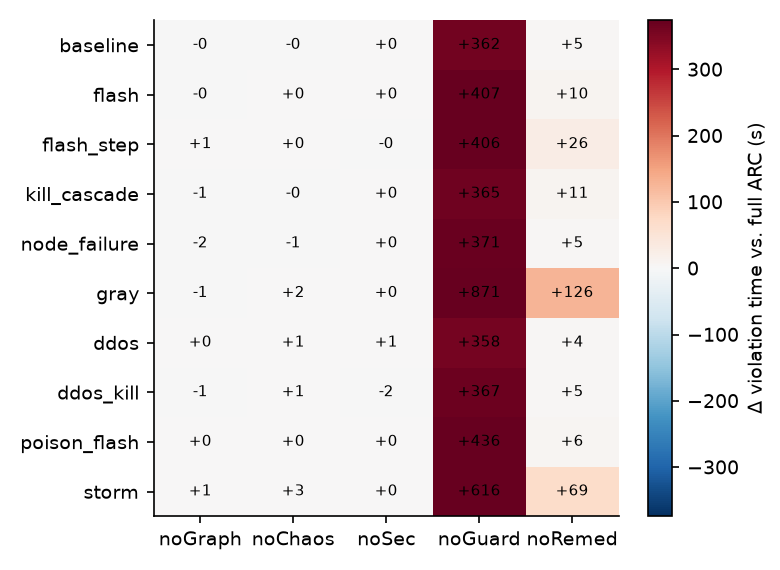
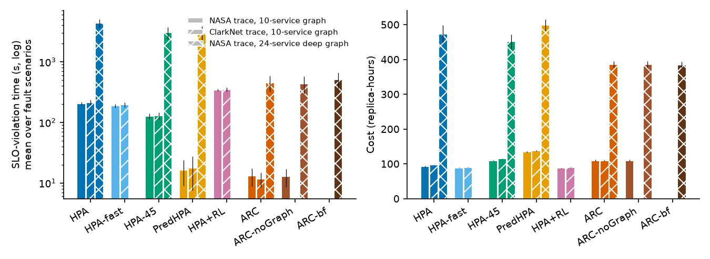
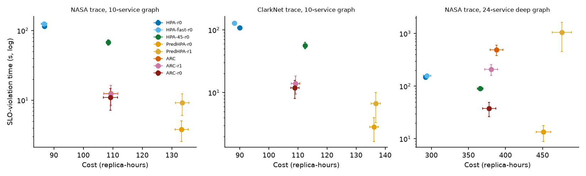

# ARC: Chaos-in-the-Loop Autonomic Control for Cloud-Native Systems — and What It Buys Beyond Retry Limits

*Draft manuscript for the special issue on resilience-by-design for cloud-native systems. All numbers are produced by the code in this repository (`results/tables.md`). The evaluation is trace-driven **simulation**, not a real-cluster study (§8).*

## Abstract

Cloud-native platforms fail through emergent behaviour — retry storms, cascading overload, gray failures and poisoned telemetry — that reactive autoscaling and post-failure recovery handle poorly. We present **ARC**, an Antifragile Resilience Controller that closes the loop between chaos engineering and autonomic control: it plans capacity from the service dependency graph, learns per-service fragility from low-blast-radius chaos probes that it runs on itself, separates attacks from flash crowds and detects poisoned telemetry by flow-conservation checks, degrades gracefully with circuit breakers and retry budgets, and vets risky actions through a safe-adaptation guardrail. We evaluate it in a trace-driven simulator on two real HTTP traces (NASA 1995, ClarkNet 1995), a 10-service and a 24-service call graph, ten stress scenarios, intensity sweeps beyond cluster quota and a repeated-stress experiment, with up to 40 held-out seeds and paired tests, and spot-check the main effects on a container testbed. Against Kubernetes-style autoscalers with default retry settings ARC cuts SLO-violation time about 10× at equal cost. **A retry-limited baseline closes most of that gap**: excluding the telemetry-poisoning scenario, an HPA with retries disabled matches ARC at equal cost, and on a deeper call graph it beats the original ARC (91 s vs. 456 s). A *pre-registered* follow-up with a proactive low retry cap (ARC-r0, fresh seeds) beats the retry-limited HPA on the registered metric in all three setups (e.g. 38 s vs. 90 s on the deep graph at +3% cost), but only because of the poisoning scenario; without it the retry-limited HPA is at parity or better, and a forecasting autoscaler without retries is more reliable at 19–25% higher cost. ARC's distinctive, replicated benefits are narrower: immunity to poisoned utilisation telemetry (shared with forecast-based autoscalers), lower loss under 4–6× surges beyond quota (8.7% vs. 15–21% at 6×), 14–26% lower cost under volumetric DDoS, and — uniquely — improvement under repeated identical stress (−22% to −24% violation time, p < 10⁻⁴; all other controllers flat, and ARC without chaos learning flat). Graph-aware planning shows no measurable effect. We report these negative results, a probe-induced failure mode and the retry confound because they change what a resilience evaluation should control for.

## 1. Introduction

Mission-critical services increasingly run as microservices on elastic, orchestrated infrastructure. Outages in such systems rarely come from a single broken component; they come from interactions: a lost dependency triggers timeouts, timeouts trigger retries, retries overload the survivors, and the autoscaler reacts only after metrics have moved and new pods have started. Adversaries make this worse, through volumetric application-layer attacks that look like legitimate surges at the resource level, or by corrupting the telemetry that autoscalers trust.

*Autoscaling and autonomic control*, *AIOps* and *chaos engineering* each address part of this problem and are rarely combined. In practice chaos experiments are run by people, offline, and their findings reach the controller only through human-written configuration.

**Contributions.**

1. **ARC**, a controller that uses chaos experiments as an *online learning signal for the autoscaler*: a UCB bandit chooses one-pod probes, and the observed stress margin updates a per-service fragility estimate that sets redundancy headroom (§4.2); plus a flow-conservation check for poisoned telemetry, attack/surge discrimination, graceful degradation and a safe-adaptation guardrail (§4.3–4.5).
2. A **stress-oriented evaluation** on real traces: ten scenarios, intensity sweeps past cluster quota, repeated exposure, baselines including cost-matched and retry-limited ones, ablations, two traces, two topologies, paired statistics and held-out seeds.
3. A **methodological finding**: in simulated microservice stress the dominant failure mode is retry amplification, and *client retry limits are a first-order confounder*. Against default-retry baselines ARC looks ~10× better; against retry-limited baselines it is roughly at parity on most scenarios and clearly worse on a deeper graph (§6.2).
4. A **map of where ARC does help** (poisoned telemetry, beyond-capacity degradation and DDoS cost, learning from repeated exposure) **and where it does not** (graph-aware planning) (§6.3–6.5), and a **pre-registered test** of a proactive-retry variant, ARC-r0, on fresh seeds, with every hypothesis outcome reported (§6.6).
5. A **real-software spot check** on a container testbed (real queuing, retries, process kills, trace replay; emulated start-up and gray failure; no Kubernetes) (§6.7).

## 2. Background and related work

**Autonomic and elastic control.** The autonomic-computing vision (Kephart & Chess, 2003) frames self-healing and self-optimisation as monitor-analyse-plan-execute loops. The Kubernetes Horizontal Pod Autoscaler scales on observed utilisation with stabilisation windows (the baseline we model); Autopilot (Rzadca et al., EuroSys 2020) is Google's production autoscaler, adjusting both the number of tasks and per-task limits. **ML-driven microservice management.** FIRM (Qiu et al., OSDI 2020) localises SLO-violating microservices with an SVM and mitigates contention with reinforcement learning, *training its models by injecting artificial performance anomalies*; Sage (Gan et al., ASPLOS 2021) uses unsupervised models over the dependency graph for root-cause analysis and corrective action. **Chaos engineering.** Basiri et al. (IEEE Software, 2016) describe the principles of chaos engineering as practised at Netflix, and Basiri et al. (ICSE-SEIP 2019) describe automating chaos experiments in production. Taleb (2012) coined *antifragility*, which we use in the operational sense that measured resilience improves with exposure to stressors. **Benchmarks and traces.** DeathStarBench (Gan et al., ASPLOS 2019) and Google's Online Boutique are standard microservice benchmarks; Alibaba's microservice traces (Luo et al., SoCC 2021) show that production call graphs are heavy-tailed and tree-like with many hot-spot services. **Resilience patterns.** Circuit breakers and bulkheads (Nygard, *Release It!*, 2007) and SRE practice (Beyer et al., 2016) motivate our breakers, retry budgets and SLO-based metrics.

**What is and is not new here.** Fault injection as a *training signal* is not new (FIRM), and chaos experiments are already automated and run continuously (Basiri et al., 2019). What we study is a narrower combination: a *live*, bandit-scheduled, guardrail-bounded one-pod probe whose measured stress margin directly sets the autoscaler's per-service redundancy headroom, together with graph-based flow-conservation checks on telemetry and attack/surge discrimination inside the same controller, evaluated under joint performance–resilience–cost–security stress. We found no prior work doing exactly this in the sources we searched, but this was a targeted search, not an exhaustive survey, and the claim should be read accordingly.

## 3. System and threat model

**System.** A microservice application with call weights `W[j][c]` (expected calls from *j* to *c* per request). Two graphs are used: a **10-service Online-Boutique-style** graph (frontend, product catalogue, recommendation, ads, cart, currency, checkout, payment, shipping, e-mail) and a **synthetic 24-service, 6-tier** graph with multipliers up to 8.8 calls per user request, used to test whether graph-aware planning matters at depth. Each service is a pool of pods with per-pod capacity μ, a bounded queue, a nominal start-up delay of 15–40 s (±30% jitter) and 2–30 replicas under a cluster-wide pod quota (120 pods; 301 for the deep graph). Calls time out after 2 s and are retried up to a cap (default 2), giving retry amplification `1 + F + F²` for a callee with failure probability *F*. Some edges are non-critical (callers degrade gracefully); the rest are critical. The ReplicaSet replaces lost pods automatically, scheduling the most under-provisioned service first when quota is scarce.

**SLO.** A 5-s tick violates the SLO when legitimate goodput / legitimate load < 95% (availability and a 1 s latency objective combined).

**Faults and attacks** (§5.2): pod kills, node failure, gray failure (pods pass liveness but serve at 30% capacity), flash crowds, L7 volumetric DDoS and *telemetry poisoning* (a compromised exporter reports 25% of its true utilisation, queue depth and error rate).

**Controller view.** Controllers see noisy (5%) telemetry; ARC plans with an *imperfect* capacity model (each μ mis-estimated by up to ±20%).

## 4. ARC design

### 4.1 Overview
Every tick ARC receives telemetry and emits desired replicas, ingress shedding fractions, retry caps, open circuit breakers, remediation orders and, rarely, a chaos probe.

### 4.2 Chaos-in-the-loop fragility learning
ARC keeps a fragility score `f_i ∈ [0,1]` per service, `f_i = max(f_chaos_i, f_inc_i)`.

* **Probes.** Every ≥10 min, when the system is healthy (availability ≥ 98% for 1 min, no attack, no scaling in flight, **load stable and ≤70% of quota**), ARC kills one pod of the service with highest `f_i + 0.25·sqrt(ln n / n_i)` (UCB), provided the model predicts post-kill utilisation ≤ 0.75. Over the next 60 s it measures peak failure fraction and utilisation and sets reward `r = min(1, 4·peak_fail + 2·max(0, peak_util − 0.9))`; `f_chaos_i ← 0.7·f_chaos_i + 0.3·r`.
* **Real incidents.** When availability recovers after an incident, graph-based root-cause analysis (the deepest unhealthy service whose critical callees are healthy) raises `f_inc_i` by `0.45·min(1, 2·peak_loss)`; it decays with a ≈2 h half-life.
* **Use.** Feed-forward capacity is multiplied by `(1 + 0.8·f_i)`: fragile services (single points of failure, slow start-up, repeatedly hit) get N+k redundancy, robust ones are right-sized.

### 4.3 Security-aware orchestration
*Attack vs. flash crowd.* An L7 classifier (modelled as noisy, TPR≈0.8 / FPR≈0.05) yields a suspect share; an attack is declared after two consecutive ticks above threshold. Then ARC sheds 85% of suspect traffic with 3% collateral shedding and plans capacity for the residual legitimate load. A flash crowd shows no suspect signal and is scaled out, not shed.
*Telemetry poisoning.* For every non-ingress service ARC estimates offered load from its callers' reported *served* rates and call weights (flow conservation). A service whose reported utilisation is below half the graph-derived value is flagged and its utilisation replaced by the graph estimate.

### 4.4 Capacity planning and the safe-adaptation guardrail
Ingress load is forecast with Holt's double exponential smoothing (60 s horizon) and propagated through the graph, `m = (I − Wᵀ)⁻¹e₀`, to per-service demand; desired replicas are `max(feed-forward, feedback on robust utilisation)` at a 65% target. **Guardrail:** scale-down is applied only if (a) the model-predicted post-action utilisation ≤ 0.8, (b) no incident is active and availability ≥ 97%, and it is limited to −20% per step with a 2-minute hold-down; chaos probes are vetoed unless post-kill utilisation ≤ 0.75, load is stable and free quota exists.

### 4.5 Graceful degradation and remediation
*Circuit breakers* cut non-critical edges for 60 s when the system is overloaded and the callee is saturated or failing. *Retry budgets* lower a caller's retry cap from 2 to 1 or 0 as its callees' failure rate rises. *Gray-failure remediation:* if a service is saturated by flow conservation yet serves <65% of its offered load while the model says it should have spare capacity, for three ticks, ARC reschedules its pods and meanwhile over-provisions it. Note that ARC's retry control is **reactive**: caps start at the default of 2 and drop only after failures are observed.

## 5. Evaluation methodology

### 5.1 Simulator and workloads
A trace-driven fluid simulator (`arcsim/`, 5 s tick) implements the system of §3. The **workloads are real**: the NASA Kennedy Space Center HTTP trace (July 1995; 1,891,714 requests) and the ClarkNet ISP HTTP trace (28 Aug – 3 Sep 1995; 1,654,882 requests) are converted to request-rate series; each episode is a 2-h window (six windows per trace, weekdays and weekends) rescaled so its 95th percentile is 600 req/s. Only the amplitude is rescaled. The first 10 min of each run are excluded from all metrics.

### 5.2 Scenarios (fixed before the first run, plus `flash_step`)
`baseline` (no fault); `flash` (3× surge, 1-min ramp); `flash_step` (3× abrupt); `kill_cascade` (70% of a shared dependency's pods lost at peak); `node_failure` (40% of the pods of four services); `gray` (one service at 30% capacity for 20 min); `ddos` (volumetric L7 attack, 2.5 units); `ddos_kill`; `poison_flash` (three exporters under-report at 25% during a 3× surge); `storm` (kill → surge → gray failure → DDoS in sequence). Timing and targets are randomised per seed.

### 5.3 Baselines
**Static** (initial sizing); **HPA** (Kubernetes algorithm: 15 s sync, 30 s window, 10% tolerance, 300 s scale-down stabilisation); **HPA-fast** (5 s sync, 10 s window); **HPA-45** (HPA at a 45% target — a *cost-matched* baseline with standing headroom); **PredHPA** (HPA plus a per-service Holt forecast of its own offered load); **HPA+RL** (HPA plus a fixed ingress rate limiter). By default all baselines use the same client settings as the system model (retry cap 2, 2 s timeout). **Retry-limited baselines**, added after seeing the first results (see §6.2 and README): `HPA-45-r1` / `HPA-45-r0` (at most one / no retries) and `PredHPA-r1`. These change *only* the retry cap; they have no breakers, shedding or remediation.

### 5.4 Metrics and statistics
SLO-violation time (s), legitimate-request loss (% of offered load, *including* requests ARC sheds deliberately), cost (replica-hours), mean time to recover from each injected fault, p95 end-to-end latency, probe overhead, DDoS detection delay, poisoning-detection F1. Means with 95% CIs; paired Wilcoxon signed-rank tests per scenario (Holm-corrected over scenarios). **Held-out seeds:** development used seeds 0–19; main results use seeds 100–139 (40 seeds; ClarkNet also 100–139), deep-graph results use seeds 200–229 (30), sweeps 20 and repeated stress 30. The pre-registered follow-up (§6.6) uses seeds 300–339 and 400–429, never used before; its protocol was committed before it was run (`experiments/PREREGISTRATION.md`). Because seeds map to six trace windows, they are not fully independent draws of the workload (§8).

## 6. Results

### 6.1 Main comparison against default-retry baselines
SLO-violation time (s; mean ± 95% CI; 10-service graph, NASA trace; bold = best of these columns):

| Scenario | HPA | HPA-fast | HPA-45 | PredHPA | HPA+RL | ARC |
|---|---|---|---|---|---|---|
| baseline | 6.2 ± 3.7 | 1.0 ± 0.6 | **0.0 ± 0.0** | 0.0 ± 0.0 | 4.8 ± 1.8 | 6.8 ± 4.8 |
| flash | 167.6 ± 42.7 | 74.5 ± 26.2 | 80.4 ± 41.9 | **2.4 ± 1.5** | 555.0 ± 29.8 | 10.1 ± 4.5 |
| flash_step | 174.1 ± 45.4 | 138.9 ± 40.3 | 101.0 ± 43.5 | **18.4 ± 14.3** | 599.6 ± 31.6 | 21.0 ± 6.3 |
| kill_cascade | 44.0 ± 7.5 | 36.6 ± 6.1 | 30.1 ± 5.8 | **17.2 ± 4.8** | 43.5 ± 7.4 | 19.2 ± 5.3 |
| node_failure | 24.8 ± 8.0 | 7.2 ± 4.5 | 2.8 ± 2.2 | **0.0 ± 0.0** | 23.6 ± 7.7 | 9.6 ± 5.2 |
| gray | 201.8 ± 71.6 | 164.8 ± 70.4 | 133.0 ± 57.6 | 103.4 ± 61.4 | 201.1 ± 72.2 | **22.8 ± 7.1** |
| ddos | 45.4 ± 13.1 | 13.8 ± 7.4 | 0.1 ± 0.2 | **0.0 ± 0.0** | 203.2 ± 34.8 | 6.1 ± 4.3 |
| ddos_kill | 62.1 ± 12.5 | 44.8 ± 9.4 | 1.9 ± 3.4 | **0.1 ± 0.2** | 225.1 ± 33.3 | 7.9 ± 4.8 |
| poison_flash | 1048.6 ± 50.6 | 1092.0 ± 36.8 | 789.4 ± 43.3 | **2.4 ± 1.5** | 1024.8 ± 44.4 | 10.9 ± 4.8 |
| storm | 77.0 ± 28.1 | 128.5 ± 70.7 | 11.8 ± 10.7 | **3.4 ± 4.2** | 220.8 ± 21.6 | 10.4 ± 3.9 |

Mean over the nine fault scenarios:

| Controller | SLO viol. (s) | Loss (%) | Cost (replica-h) | MTTR (s) | p95 latency (s) |
|---|---|---|---|---|---|
| Static | 2916.8 | 48.92 | 54.5 | 649.2 | 5.80 |
| HPA | 205.0 | 5.94 | 93.2 | 139.8 | 0.71 |
| HPA-fast | 189.0 | 5.34 | 89.0 | 129.7 | 0.75 |
| HPA-45 | 127.8 | 4.31 | 110.3 | 99.1 | 0.63 |
| PredHPA | 16.4 | 0.29 | 134.8 | 16.1 | 0.21 |
| HPA+RL | 344.1 | 6.80 | 87.8 | 132.5 | 0.65 |
| **ARC** | **13.1** | 0.32 | 110.0 | **7.6** | **0.08** |

Against these default-retry baselines ARC outperforms HPA and HPA+RL in all nine fault scenarios (Holm-corrected p ≤ 0.003), HPA-fast in seven, and the cost-matched HPA-45 in five (flash, flash_step, kill_cascade, gray, poison_flash); at the same cost (110 replica-hours) its violation time is ~10× lower than HPA-45's. HPA-45 is better in `ddos`, `ddos_kill` and the fault-free case, and **PredHPA is as good or better on SLO violation in most scenarios** at 18% higher cost (134.8 vs. 110.0 replica-hours). Poisoned telemetry blinds every utilisation-driven autoscaler (29–34% of requests lost) but not ARC (0.1%) nor PredHPA, whose forecast uses request rates. Resilience costs money in quiet times: in the fault-free scenario ARC runs 103.2 replica-hours vs. 73.8 for HPA. **These comparisons are conditional on every baseline using a retry cap of 2; §6.2 shows that this condition matters a great deal.**

### 6.2 The retry confound: how much of the gain is just retry control?
Retry amplification is the dominant cascading mechanism in the simulator, and ARC's retry budgets and circuit breakers act on it. A fair baseline must therefore be allowed to limit retries. Adding *only* a retry cap to the baselines (mean over the nine fault scenarios, 10-service graph):

| Controller | SLO viol. (s) | Loss (%) | Cost (replica-h) | MTTR (s) |
|---|---|---|---|---|
| HPA-45 (retries 2) | 127.8 | 4.31 | 110.3 | 99.1 |
| HPA-45-r1 | 96.5 | 3.49 | 109.4 | 60.8 |
| HPA-45-r0 | 67.9 | 2.42 | 108.3 | 20.4 |
| PredHPA (retries 2) | 16.4 | 0.29 | 134.8 | 16.1 |
| PredHPA-r1 | 7.5 | 0.13 | 134.3 | 7.2 |
| **ARC** | 13.1 | 0.32 | 110.0 | 7.6 |

*On the 10-service graph*, retry limits remove roughly half of HPA-45's deficit. The remaining aggregate gap to ARC (67.9 s vs. 13.1 s) is almost entirely the `poison_flash` scenario (515.6 s for HPA-45-r0 vs. 10.9 s for ARC). **Excluding `poison_flash`, HPA-45-r0 averages 12.0 s and ARC 13.4 s at the same cost (107.8 vs. 108.9 replica-hours)**, and paired tests give ARC better in 2 of 10 scenarios, no difference in 4 and worse in 4. PredHPA-r1 is better than ARC on SLO violation in 8 of 10 scenarios (7.5 s vs. 13.1 s) and ARC is never better, at 22% higher cost.
*On the 24-service deep graph* (§6.5) the effect is larger: HPA-45-r0 achieves 90.6 s of violations, 3.4% loss and 366.8 replica-hours, against ARC's 456.5 s, 11.2% and 386.4: **a one-line configuration change beats ARC there** in 8 of 10 scenarios (n.s. in 2).

In short, most of ARC's apparent advantage over Kubernetes-style autoscalers in §6.1 is attributable to controlling retry amplification, which a static retry limit reproduces to a large degree. ARC's retry control is also the weak part of its design: it starts from the default cap of 2 and reacts only after failures appear.

### 6.3 Where ARC does add value
**(a) Poisoned utilisation telemetry.** With default retries every utilisation-driven autoscaler loses 29–34% of requests; even retry-limited, HPA-45-r0 accumulates 516 s of violations vs. ARC's 10.9 s. Forecasting autoscalers that ignore the poisoned signals (PredHPA 2.4 s, PredHPA-r1 2.2 s) are equally immune, so the *mechanism* — not specifically ARC's graph check — is what matters; ARC's check (F1 = 0.67 ± 0.03) is not needed for its own SLO outcome, because its feed-forward planning is anchored on ingress rate.

**(b) Surges beyond capacity.** Legitimate-request loss (%) as the surge grows past the 120-pod quota (20 seeds; cost at 6×: HPA-45-r0 124, ARC 124, PredHPA-r1 146 replica-hours):

| Surge (× load) | 2 | 3 | 4 | 5 | 6 |
|---|---|---|---|---|---|
| HPA-45 | 0.3 | 2.2 | 22.0 | 34.5 | 45.7 |
| HPA-45-r0 | 0.1 | 0.7 | 2.5 | 7.3 | 19.5 |
| PredHPA | 0.0 | 0.1 | 5.9 | 19.4 | 30.2 |
| PredHPA-r1 | 0.0 | 0.1 | 4.1 | 9.7 | 23.4 |
| **ARC** | 0.1 | 0.1 | **1.1** | **5.9** | **12.2** |

ARC degrades most gracefully (12.2% vs. 19.5–23.4% at 6×, at equal or lower cost). We did not run ablations inside the sweeps, so we attribute this to circuit-breaking and shedding only by consistency with §6.4.

**(c) Volumetric DDoS.** Loss (%) at attack volume 1/2/3/5/8 units: ARC 0.5 throughout (the collateral-shedding rate); HPA-45-r0 0.0/0.0/0.0/0.3/0.7; PredHPA-r1 0/0/0/0/6.5; HPA-45 0.0/0.0/0.1/6.8/13.3. ARC's advantage here is **cost**, not loss: at 8 units it uses 109 replica-hours vs. 125 (HPA-45-r0, −13%) and 146 (PredHPA-r1, −25%), because it sheds rather than scales out for attack traffic; at low volume its collateral shedding costs 0.5% of legitimate requests that the baselines do not lose. Detection took 7.4 ± 0.7 s.

**(d) Gray failures.** ARC 22.8 s, HPA-45-r0 24.9 s, PredHPA-r1 36.0 s, HPA-45 133.0 s, PredHPA 103.4 s: ARC is on par with the best retry-limited baseline, and far better than the default-retry ones.

**(e) Learning from repeated exposure (antifragility).** The same three pod-kill faults hit every 30 min for 6 h with **identical load every epoch**:

| Controller | epochs 1–3 (s) | epochs 8–11 (s) | change | mean pods |
|---|---|---|---|---|
| HPA | 98.9 ± 11.4 | 97.5 ± 11.0 | −1% (n.s.) | 54.9 |
| HPA-fast | 85.5 ± 15.0 | 88.7 ± 14.6 | +4% (n.s.) | 49.2 |
| HPA-45 | 76.5 ± 9.8 | 75.6 ± 8.6 | −1% (n.s.) | 67.4 |
| HPA-45-r0 | 43.2 ± 4.4 | 42.5 ± 4.6 | −2% (n.s.) | 55.3 |
| HPA-45-r1 | 54.3 ± 5.7 | 54.6 ± 5.3 | +1% (n.s.) | 60.3 |
| PredHPA | 38.1 ± 9.1 | 36.5 ± 9.3 | −4% (n.s.) | 81.0 |
| PredHPA-r1 | 31.8 ± 7.7 | 31.0 ± 7.6 | −3% (n.s.) | 74.6 |
| ARC without chaos learning | 33.1 ± 5.8 | 33.5 ± 5.6 | +1% (n.s.) | 57.6 |
| **ARC** | 29.6 ± 5.8 | **22.5 ± 5.6** | **−24% (p = 5·10⁻⁵)** | 61.1 |

Only full ARC improves with exposure, and only chaos learning makes the difference (ARC without it is flat). The effect is moderate (−24%), and the late-epoch level (22.5 s) is below every baseline's while using fewer pods than the forecasting ones. (With the real, drifting load ARC improved 51% but HPA-45 and PredHPA also improved by 31–36% because the trace itself drifts, so we report the identical-load run as the clean test; see `results/tables.md`.)

### 6.4 Ablation
SLO-violation time (s), 10-service graph (40 seeds):

| Scenario | ARC | −Graph | −Chaos | −Sec | −Guard | −Remed |
|---|---|---|---|---|---|---|
| baseline | 6.8 ± 4.8 | 6.2 ± 4.4 | 6.5 ± 4.5 | 6.8 ± 4.8 | 368.6 ± 27.7 | 11.5 ± 8.0 |
| flash_step | 21.0 ± 6.3 | 21.6 ± 6.3 | 21.5 ± 6.1 | 20.9 ± 6.3 | 426.9 ± 30.9 | 47.4 ± 21.9 |
| kill_cascade | 19.2 ± 5.3 | 18.1 ± 4.9 | 18.9 ± 5.1 | 19.8 ± 5.6 | 383.9 ± 26.6 | 30.0 ± 8.6 |
| gray | 22.8 ± 7.1 | 22.1 ± 7.1 | 24.4 ± 8.0 | 23.2 ± 7.4 | 893.9 ± 102.6 | 148.5 ± 65.5 |
| poison_flash | 10.9 ± 4.8 | 11.4 ± 5.3 | 11.4 ± 5.1 | 10.9 ± 4.8 | 447.4 ± 34.2 | 17.0 ± 8.5 |
| storm | 10.4 ± 3.9 | 11.4 ± 4.4 | 13.0 ± 4.5 | 10.9 ± 4.6 | 625.9 ± 95.5 | 79.1 ± 67.0 |

*Remediation/graceful degradation* matters (gray 6.5×, storm 7.6×, flash_step 2.3×). The *guardrail* matters most, but note that `−Guard` removes both the model check and the scale-down hold-down, so it oscillates and violates the SLO even without faults while using 27% fewer replica-hours (80.0 vs. 109.3); this shows an unguarded predictive controller is unsafe rather than isolating the model check alone, and its probes cause 45.2 s of SLO harm per run vs. 1.0 s for ARC. **Graph planning, the security layer and chaos learning are within confidence intervals of full ARC in every main scenario**; chaos learning's effect appears only under repeated exposure (§6.3e), and the security layer's measurable value is operational (DDoS detection, cost) rather than SLO.

### 6.5 Robustness: a second trace and a deeper call graph
**Second trace (ClarkNet, 10-service graph, 40 seeds).** The ranking is unchanged. Mean over fault scenarios: ARC 11.6 s / 0.28% loss / 109.6 replica-hours / MTTR 6.3 s; PredHPA 17.6 s / 0.30% / 137.6 / 16.1; HPA-45 128.6 s / 3.95% / 115.0 / 92.4; HPA 213.8 s / 5.87% / 97.0 / 171.2. Paired tests: ARC better than HPA in 8 scenarios (n.s. in 2), than HPA-45 in 5 (worse in 3), and PredHPA better than ARC in 8 (n.s. in 2) — the same pattern as the NASA trace (the gray-failure advantage over PredHPA, 19.0 s vs. 130.2 s, is not significant after Holm correction here). We did not run retry-limited baselines on ClarkNet.

**Deeper call graph (24 services, NASA trace, 30 seeds).** Defaults are catastrophic for Kubernetes-style autoscalers: HPA 4,393 s, HPA-45 3,027 s, PredHPA 3,027 s of violations (loss 48–69%) against ARC's 456 s (11.2%), at *lower* cost (386 vs. 452–499 replica-hours). Ablations in this graph: ARC-noGraph 436 s (**no significant difference in any scenario** — graph-aware planning does not help even at depth), ARC with bounded feedback 513 s (also n.s.), **ARC without remediation/graceful degradation 3,170 s** (equal to PredHPA/HPA-45) and without the guardrail 4,930 s. So in the deep graph the whole advantage over default autoscalers comes from graceful degradation. But, as shown in §6.2, a retry-limited HPA-45-r0 gets 90.6 s, which beats ARC in 8 of 10 scenarios; ARC's reactive retry control is much worse than not retrying at all in a deep chain.

### 6.6 Pre-registered test: ARC with proactive retry limits
Prompted by §6.2, we registered (before running; `experiments/PREREGISTRATION.md`) a variant **ARC-r0** whose retry cap starts at 0 instead of 2 (its budget logic and everything else are unchanged; `ARC-r1` starts at 1), plus further retry-limited baselines (`HPA-r0`, `HPA-fast-r0`, `HPA-45-r0`, `PredHPA-r0`, `PredHPA-r1`). Fresh seeds: 300–339 (10-service graph, NASA and ClarkNet) and 400–429 (24-service graph). Mean over the nine fault scenarios (SLO-violation time in s / cost in replica-hours):

| Controller | NASA, 10 services | ClarkNet, 10 services | NASA, 24 services |
|---|---|---|---|
| HPA-45-r0 | 68.1 / 108.5 | 56.7 / 112.5 | 90.3 / 365.9 |
| PredHPA-r0 | **3.8** / 133.3 | **2.8** / 136.2 | **13.4** / 451.3 |
| PredHPA-r1 | 9.2 / 133.6 | 6.7 / 136.8 | 1048.0 / 475.9 |
| ARC (retry cap 2) | 12.4 / 109.3 | 13.9 / 109.1 | 493.8 / 387.9 |
| ARC-r1 | 12.4 / 109.3 | 13.9 / 109.1 | 209.1 / 380.6 |
| **ARC-r0** | 10.9 / 109.2 | 11.9 / 109.0 | 37.7 / 377.9 |

**Scorecard.**

| Hypothesis | NASA, 10 | ClarkNet, 10 | NASA, 24 |
|---|---|---|---|
| H1: ARC-r0 violations ≤ best of {HPA-r0, HPA-fast-r0, HPA-45-r0}, cost ≤ +5% | **Pass** (10.9 vs. 68.1 s, p = 4·10⁻⁸; cost +0.7%) | **Pass** (11.9 vs. 56.7 s; cost −3.2%) | **Pass** (37.7 vs. 90.3 s, p = 2·10⁻⁶; cost +3.3%) |
| H2: ≥15% cheaper than PredHPA-r1 with violations within its 95% CI | **Pass** (−18.3% cost; 10.9 vs. 9.2 ± 3.2 s) | **Partial**: cost −20.3% yes; violations 11.9 vs. 6.7 ± 3.4 s no | **Pass** (−20.6%; PredHPA-r1 collapses) |
| H3: ARC-r0 < HPA-45-r0 in `poison_flash` | **Pass** (9.6 vs. 513 s) | **Pass** (10.0 vs. 438 s) | **Pass** (80 vs. 604 s) |
| H4: ARC-r0 improves in repeated stress; ARC-r0 without chaos learning does not | **Pass**: −22% (p = 3·10⁻⁵) vs. +0% (p = 0.90) | | |

**What the scorecard hides.** (i) *H1 passes because of one scenario.* Excluding `poison_flash`, mean violation time of ARC-r0 / HPA-45-r0 / PredHPA-r0 is 11.1 / 12.4 / 4.0 s (NASA), 12.1 / 9.1 / 2.8 s (ClarkNet) and 32.5 / 26.2 / 11.6 s (24 services): ARC-r0 is at parity on NASA and *worse* than the retry-limited HPA in the other two setups. (ii) *A forecasting autoscaler with no retries is more reliable than ARC-r0 everywhere*, at 19–25% higher cost; ARC-r0 and PredHPA-r0 are two points on a cost–reliability trade-off, and neither dominates. (iii) *The retry cap is the dominant ARC parameter on the deep graph*: 494 s, 209 s and 38 s for caps 2, 1 and 0; on the 10-service graphs `ARC-r1` is indistinguishable from `ARC` (355 of 400 runs identical) because the cap only matters before ARC's own retry budget reacts. Likewise PredHPA-r1 collapses on the deep graph (1,048 s vs. 13 s for r0): in a 24-service call chain a single retry is enough to sustain a retry storm.

**Sweeps and DDoS** (20 seeds, 300–319). Loss (%) at surge 4/5/6×: ARC-r0 0.4 / 2.4 / 8.7, HPA-45-r0 1.5 / 4.6 / 15.3, PredHPA-r1 2.3 / 6.8 / 20.6, ARC (cap 2) 1.1 / 4.5 / 11.7. Under volumetric DDoS ARC-r0 loses a constant 0.5% (collateral shedding) at 1–8 attack units at 102–108 replica-hours, vs. 96–125 (HPA-45-r0) and 124–146 (PredHPA-r1); at 8 units HPA-45-r0 loses 0.7% and PredHPA-r1 4.3%. The cost advantage under attack (−14% / −26% at 8 units) and the beyond-quota advantage replicate; the DDoS loss advantage does not exist.

**Net.** The proactive retry cap makes ARC competitive with the best retry-limited HPA on the registered metric, and the registered hypotheses (H1–H4) hold as stated, but the margin comes from telemetry poisoning, a regime where forecast-based autoscalers are equally immune. What replicates independently of the scenario mix is the behaviour beyond capacity, the cost under attack and learning from repeated exposure.

### 6.7 Container testbed spot check
*Pending: the container-testbed experiment (45 runs, protocol pre-registered in `experiments/PREREGISTRATION.md`) is still running; its results will be added here.*

## 7. Discussion

**What carries the benefit.** In our simulator, cascading failure is mostly retry amplification, and the largest single lever is client retry policy. ARC's graceful-degradation machinery (breakers, retry budgets, gray-failure remediation) and its guardrail are the parts of ARC that matter; its forecasting adds little beyond what a per-service forecaster provides, and graph-aware planning shows no effect in either topology. This is a negative result for graph-aware capacity planning *as implemented*; richer topologies, heavy-tailed call graphs (cf. Alibaba traces) or higher-order effects might change it.

**Where an integrated controller still pays off.** ARC's distinctive wins are in regimes a static configuration cannot cover: (i) beyond-capacity surges, where selective degradation preserves more legitimate traffic at the same cost (8.7% vs. 15–21% loss at 6× with ARC-r0); (ii) volumetric attacks, where shedding rather than scaling saves 14–26% cost; (iii) repeated exposure, where chaos-in-the-loop learning measurably reduces future impact (−22% to −24%) and no other tested controller does; and (iv) poisoned telemetry, where it matches the immunity of forecast-based autoscalers while still using feedback. The pre-registered ARC-r0 shows that a proactive low retry cap is the right default for ARC; it makes ARC competitive with the best retry-limited HPA on the registered metric, but not more reliable than a forecasting autoscaler with no retries, which costs 19–25% more.

**Chaos probes need guardrails.** In development, a probe killed one of two payment pods during a surge that had already exhausted the cluster quota; the replacement could not be scheduled and checkout failed repeatedly for about 200 s of SLO violation. Two lessons: probes must be conditioned on stable load and free quota, and the simulated scheduler's index-order bias (which starved late services) had been unfairly penalising *every* controller. Both were fixed before the final evaluation.

**Evaluation lesson.** Resilience comparisons should control client retry and timeout policy, report results with and without the strongest simple configuration, and separate aggregate means from scenario-level outcomes: a single scenario (`poison_flash`) accounts for most of the apparent aggregate gap between ARC and a retry-limited HPA.

**Cost of resilience.** ARC runs 103.2 replica-hours in the fault-free scenario vs. 91.5 for HPA-45 (+13%) and 73.8 for HPA (+40%).

## 8. Threats to validity

* **Simulation, not a cluster.** Capacities, start-up delays, queueing, retry behaviour and fault effects are modelling assumptions. We did not run a real-cluster validation (no container runtime was available). In particular, the dominant role of retry amplification may be exaggerated or dampened in real systems that use adaptive retry budgets, hedging or load shedding at the mesh layer. A kind/minikube + Online Boutique + Chaos Mesh replication is the first follow-up.
* **Workload realism.** Both traces are 1995 web-server logs that supply arrival patterns only; neither has a microservice call graph. Six 2-h windows per trace limit workload diversity and make seeds non-independent across windows.
* **Authored faults, baselines and topologies.** We designed the faults and re-implemented the baselines; the HPA is a faithful model of the documented algorithm, not Kubernetes itself. The 24-service graph is synthetic (fixed generator seed), its capacities are set so that each service needs 3–8 pods at the design peak, and its call multipliers (up to 8.8) make it much harsher than typical graphs; its catastrophic default-autoscaler results should not be read as typical.
* **Retry settings.** The default retry cap of 2 for baselines was our assumption. The retry-limited baselines and ARC-r0 were created after seeing the earlier results; their evaluation was pre-registered on fresh seeds and all hypotheses are reported, but the variant itself is a response to those results. Retry-limited baselines in §6.2 were not run on ClarkNet (§6.6 does include them).
* **Iteration after seeing results.** Scenarios were fixed before the first run (only `flash_step` added); stronger baselines, scheduler fairness and the probe guardrail were added during development (README). The deep-graph results use seeds 200–229, which were not used for the main comparison (a handful of development-seed checks on the deep graph, seeds 0–5 and 100–101, preceded them); the retry-limited baselines on the 10-service graph reuse seeds 100–139 already used by the main comparison.
* **Model mismatch.** ARC's internal model errs by ±20% per service; larger or structural mismatch was not tested.
* **Pre-registration scope.** The pre-registered hypotheses concern the mean over nine fault scenarios, which a single scenario (`poison_flash`) can dominate (§6.6); we report the scenario-excluded means as well. The pre-registration was written by the same party that ran the experiments.
* **Multiple comparisons.** Holm correction is applied within each baseline across scenarios, not across baselines.

## 9. Conclusion

Closing the loop between chaos engineering and autonomic control is feasible, and in simulation on real HTTP traces it yields a controller that recovers an order of magnitude faster than default-configured Kubernetes-style autoscalers at equal cost, degrades gracefully beyond cluster capacity, resists poisoned telemetry, saves cost under volumetric attack and — uniquely among the tested controllers — improves with repeated exposure to the same faults. A careful stress evaluation also shows the limits of that claim: most of the gap to default autoscalers is retry-amplification control that a static retry limit largely reproduces; a pre-registered ARC variant with a proactive low retry cap beats the best retry-limited HPA on the registered metric in all three tested setups, but only because of the poisoning scenario; a forecasting autoscaler without retries is more reliable at 19–25% higher cost; and graph-aware capacity planning shows no benefit. The practical recommendations are to evaluate resilience mechanisms against retry-limited baselines, to treat chaos probes as guarded actions, and to default to low retry caps in any controller that degrades gracefully. The next steps are validation on a real Kubernetes cluster and on modern microservice traces.

## Reproducibility

Everything (simulator, controllers, scenarios, seeds, analysis, tests) is in this repository; see `README.md`. Full tables: `results/tables.md`. Figures: `figures/`.

## References

Journal/conference references 1–8 were checked against the publishers' or authors' pages while preparing this draft; books and datasets (9–13) are standard references that should be re-checked for edition and URL before submission.

1. Basiri, A., Behnam, N., de Rooij, R., Hochstein, L., Kosewski, L., Reynolds, J., Rosenthal, C. Chaos Engineering. *IEEE Software* 33(3):35–41, 2016. doi:10.1109/MS.2016.60
2. Basiri, A. et al. Automating chaos experiments in production. *ICSE-SEIP* 2019. arXiv:1905.04648
3. Gan, Y. et al. An open-source benchmark suite for microservices and their hardware-software implications for cloud & edge systems (DeathStarBench). *ASPLOS* 2019. doi:10.1145/3297858.3304013
4. Gan, Y., Liang, M., Dev, S., Lo, D., Delimitrou, C. Sage: practical and scalable ML-driven performance debugging in microservices. *ASPLOS* 2021. doi:10.1145/3445814.3446700
5. Kephart, J. O., Chess, D. M. The vision of autonomic computing. *IEEE Computer* 36(1):41–50, 2003.
6. Luo, S., Xu, H., Lu, C., Ye, K., Xu, G., Zhang, L., Ding, Y., He, J., Xu, C. Characterizing microservice dependency and performance: Alibaba trace analysis. *SoCC* 2021, pp. 412–426. doi:10.1145/3472883.3487003
7. Qiu, H., Banerjee, S. S., Jha, S., Kalbarczyk, Z. T., Iyer, R. K. FIRM: an intelligent fine-grained resource management framework for SLO-oriented microservices. *OSDI* 2020, pp. 805–825.
8. Rzadca, K. et al. Autopilot: workload autoscaling at Google. *EuroSys* 2020. doi:10.1145/3342195.3387524
9. Beyer, B., Jones, C., Petoff, J., Murphy, N. R. *Site Reliability Engineering.* O'Reilly, 2016.
10. Nygard, M. *Release It!* Pragmatic Bookshelf, 2007.
11. Taleb, N. N. *Antifragile: Things That Gain from Disorder.* Random House, 2012.
12. The Internet Traffic Archive. NASA-HTTP trace (July 1995) and ClarkNet-HTTP trace (28 Aug – 3 Sep 1995). ita.ee.lbl.gov
13. Google Cloud Platform. Online Boutique (microservices-demo). github.com/GoogleCloudPlatform/microservices-demo
